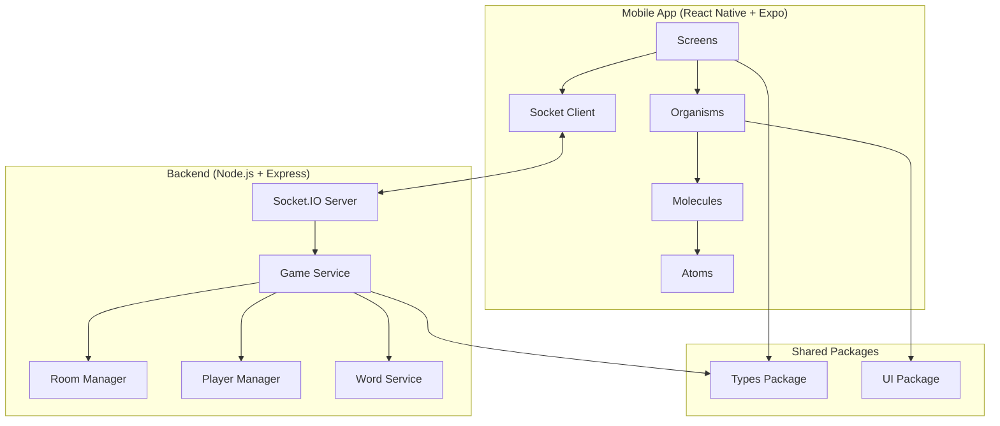

# Design Document

## Overview

The Skribbl.io clone is a real-time multiplayer drawing game built as an NX monorepo with TypeScript throughout. The architecture consists of a React Native (Expo) mobile app communicating with a Node.js/Express backend via Socket.IO for real-time gameplay. The system supports up to 8 players per room, with turn-based drawing rounds where one player draws while others guess the word.

### Key Design Principles
- **Real-time Communication**: Socket.IO handles all real-time events (drawing, chat, game state)
- **Atomic Design**: Frontend follows atomic design methodology for scalable UI components
- **Type Safety**: Shared TypeScript types ensure consistency across frontend and backend
- **Stateless Backend**: Game state is managed in memory with proper cleanup mechanisms
- **Event-Driven Architecture**: All game interactions are handled through typed Socket.IO events
- **Reactive State Management**: MobX provides reactive state management for the mobile app

## Architecture

### High-Level Architecture



### Monorepo Structure
```
apps/
├── mobile/                 # React Native Expo app
│   ├── src/
│   │   ├── components/
│   │   │   ├── atoms/      # Basic UI elements (Button, Input, Text)
│   │   │   ├── molecules/  # Simple combinations (PlayerCard, ChatMessage)
│   │   │   ├── organisms/  # Complex components (Canvas, Scoreboard, Chat)
│   │   │   └── templates/  # Page layouts
│   │   ├── screens/        # Full screen components
│   │   ├── stores/         # MobX stores for state management
│   │   ├── services/       # Socket client, API calls
│   │   ├── hooks/          # Custom React hooks
│   │   └── utils/          # Helper functions
│   └── __tests__/          # Test files
├── server/                 # Node.js backend
│   ├── src/
│   │   ├── routes/         # Express routes
│   │   ├── services/       # Business logic
│   │   ├── socket/         # Socket.IO event handlers
│   │   ├── models/         # Data models
│   │   ├── utils/          # Helper functions
│   │   └── middleware/     # Express middleware
│   └── __tests__/          # Test files
packages/
├── types/                  # Shared TypeScript types
│   ├── socket-events.ts    # Socket.IO event definitions
│   ├── game-models.ts      # Game state interfaces
│   └── player-models.ts    # Player and room interfaces
└── ui/                     # Shared UI components (optional)
```

## Components and Interfaces

### Frontend Component Hierarchy (Atomic Design)

#### Atoms
- **Button**: Reusable button with variants (primary, secondary, disabled)
- **Input**: Text input with validation states
- **Text**: Typography component with size and color variants
- **Icon**: SVG icon component with size variants
- **Timer**: Countdown timer display component

#### Molecules
- **PlayerCard**: Player name, score, and status indicator
- **ChatMessage**: Message bubble with sender info and timestamp
- **ColorPicker**: Drawing tool color selection
- **BrushSizePicker**: Drawing tool size selection
- **RoomCodeDisplay**: Room code with copy functionality

#### Organisms
- **DrawingCanvas**: Interactive canvas with drawing tools and real-time updates
- **ChatPanel**: Chat input, message list, and scroll management
- **Scoreboard**: Player list with scores and current turn indicator
- **GameControls**: Drawing tools, clear canvas, and game actions
- **PlayerList**: List of connected players with status

#### Templates
- **GameLayout**: Main game screen layout with canvas, chat, and scoreboard
- **LobbyLayout**: Room creation/joining layout
- **LoadingLayout**: Loading states and connection status

#### Screens
- **HomeScreen**: Create/join room options
- **LobbyScreen**: Waiting room before game starts
- **GameScreen**: Main gameplay interface
- **ResultsScreen**: End game results and scores

### MobX Store Architecture

#### Core Stores

**GameStore**
- Manages overall game state (current room, game phase, round info)
- Handles game flow transitions and timer management
- Coordinates between other stores for game actions
- Provides computed values for UI state

**PlayerStore**
- Manages current player information and authentication state
- Tracks player scores, turn status, and connection state
- Handles player actions and preferences
- Provides player-specific computed properties

**RoomStore**
- Manages room data (players list, room code, capacity)
- Handles room joining/leaving and player management
- Tracks room state changes and updates
- Provides room-related computed values

**DrawingStore**
- Manages drawing canvas state and tool settings
- Handles drawing data and real-time updates
- Manages brush settings, colors, and canvas history
- Provides drawing-related computed properties

**ChatStore**
- Manages chat messages and input state
- Handles message sending and receiving
- Tracks chat history and unread indicators
- Provides chat-related computed values

#### Store Integration
- **Root Store**: Combines all stores and provides dependency injection
- **Store Context**: React context for accessing stores in components
- **Observer Components**: Components wrapped with MobX observer for reactivity
- **Actions**: All state mutations happen through MobX actions
- **Computed Values**: Derived state calculated automatically from observables

### Backend Service Architecture

#### Core Services

**GameService**
- Manages overall game flow and state transitions
- Handles round progression and turn management
- Coordinates between different game components
- Validates game actions and state changes

**RoomManager**
- Creates and manages game rooms
- Handles room codes and player capacity
- Manages room lifecycle and cleanup
- Broadcasts room state changes

**PlayerManager**
- Manages player connections and sessions
- Handles player joining/leaving
- Tracks player scores and statistics
- Manages player turn rotation

**WordService**
- Provides random words for drawing rounds
- Manages word difficulty levels
- Handles word validation for guesses
- Maintains word lists and categories

#### Socket.IO Event Handlers
- **ConnectionHandler**: Manages client connections and disconnections
- **RoomHandler**: Handles room creation, joining, and leaving
- **GameHandler**: Manages game start, rounds, and turns
- **DrawingHandler**: Processes and broadcasts drawing data
- **ChatHandler**: Manages chat messages and guess validation

## Data Models

### Core Interfaces

```typescript
// Player model
interface Player {
  id: string;
  name: string;
  score: number;
  isDrawing: boolean;
  isConnected: boolean;
  joinedAt: Date;
}

// Room model
interface Room {
  id: string;
  code: string;
  players: Player[];
  currentDrawer: string | null;
  currentWord: string | null;
  roundNumber: number;
  maxRounds: number;
  gameState: GameState;
  createdAt: Date;
  lastActivity: Date;
}

// Game state enum
enum GameState {
  WAITING = 'waiting',
  STARTING = 'starting',
  PLAYING = 'playing',
  ROUND_END = 'round_end',
  GAME_END = 'game_end'
}

// Drawing data model
interface DrawingData {
  x: number;
  y: number;
  prevX?: number;
  prevY?: number;
  color: string;
  brushSize: number;
  isDrawing: boolean;
  timestamp: number;
}

// Chat message model
interface ChatMessage {
  id: string;
  playerId: string;
  playerName: string;
  message: string;
  isCorrectGuess: boolean;
  timestamp: Date;
}
```

### Socket.IO Event Types

```typescript
// Client to Server events
interface ClientToServerEvents {
  'room:create': (playerName: string) => void;
  'room:join': (roomCode: string, playerName: string) => void;
  'room:leave': () => void;
  'game:start': () => void;
  'drawing:stroke': (drawingData: DrawingData) => void;
  'drawing:clear': () => void;
  'chat:message': (message: string) => void;
}

// Server to Client events
interface ServerToClientEvents {
  'room:created': (room: Room) => void;
  'room:joined': (room: Room) => void;
  'room:updated': (room: Room) => void;
  'room:error': (error: string) => void;
  'game:started': (currentDrawer: Player, word: string) => void;
  'game:round_end': (results: RoundResults) => void;
  'game:end': (finalScores: Player[]) => void;
  'drawing:update': (drawingData: DrawingData) => void;
  'drawing:cleared': () => void;
  'chat:message': (message: ChatMessage) => void;
  'player:joined': (player: Player) => void;
  'player:left': (playerId: string) => void;
}
```

## Error Handling

### Frontend Error Handling
- **Connection Errors**: Display reconnection UI and retry mechanisms
- **Validation Errors**: Show inline form validation with clear error messages
- **Game State Errors**: Handle invalid game states gracefully with fallbacks
- **Network Errors**: Implement offline detection and queue actions when possible

### Backend Error Handling
- **Input Validation**: Use Zod schemas to validate all incoming data
- **Socket Errors**: Emit specific error events with user-friendly messages
- **Room Management**: Handle room not found, full rooms, and invalid codes
- **Memory Management**: Implement cleanup for disconnected players and empty rooms

### Error Recovery Strategies
- **Automatic Reconnection**: Socket.IO client auto-reconnects with exponential backoff
- **State Synchronization**: Re-sync game state when players reconnect
- **Graceful Degradation**: Continue game with fewer players if some disconnect
- **Timeout Handling**: Implement timeouts for drawing turns and room inactivity

## Testing Strategy

### Frontend Testing
- **Unit Tests**: Test individual components with React Testing Library
- **Store Tests**: Test MobX stores with actions, reactions, and computed values
- **Integration Tests**: Test component interactions and state management
- **Socket Tests**: Mock Socket.IO client and test event handling
- **Visual Tests**: Snapshot testing for UI components
- **E2E Tests**: Test complete user flows with Detox

### Backend Testing
- **Unit Tests**: Test individual services and utilities with Jest
- **Integration Tests**: Test Socket.IO event flows with socket.io-client
- **API Tests**: Test Express routes and middleware
- **Load Tests**: Test concurrent connections and room capacity
- **Memory Tests**: Verify proper cleanup and memory management

### Test Coverage Requirements
- **100% Line Coverage**: All code paths must be tested
- **Branch Coverage**: All conditional branches must be covered
- **Function Coverage**: All functions must have test cases
- **Statement Coverage**: All statements must be executed in tests

### Test Documentation Standards
- **File Headers**: All test files must include @fileoverview JSDoc headers explaining purpose and requirements coverage
- **Test Suite Documentation**: Each describe block must have descriptive comments explaining what is being tested
- **Individual Test Comments**: Each test case must include comments explaining the specific behavior being validated
- **Mock Data Documentation**: Test fixtures must include comments explaining their purpose and structure
- **Requirements Traceability**: Tests must include comments linking to specific requirement numbers
- **Beginner-Friendly Comments**: Test comments must follow the same accessibility standards as production code

### Testing Tools and Mocks
- **Jest**: Primary testing framework for both frontend and backend
- **React Testing Library**: Component testing for React Native
- **Socket.IO Mock**: Mock Socket.IO connections for isolated testing
- **Supertest**: HTTP endpoint testing for Express routes
- **MSW**: Mock Service Worker for API mocking in tests

## Performance Considerations

### Real-time Optimization
- **Event Throttling**: Limit drawing events to 60fps to prevent spam
- **Data Compression**: Minimize payload size for drawing coordinates
- **Connection Pooling**: Efficiently manage Socket.IO connections
- **Memory Management**: Regular cleanup of inactive rooms and players

### Mobile Optimization
- **Canvas Performance**: Use native drawing components where possible
- **State Management**: Minimize re-renders with efficient state updates
- **Network Efficiency**: Batch non-critical updates and compress data
- **Battery Optimization**: Reduce background processing and network calls

### Scalability Considerations
- **Room Limits**: Cap concurrent rooms and players per server instance
- **Load Balancing**: Design for horizontal scaling with sticky sessions
- **Database Integration**: Plan for persistent storage if needed for analytics
- **CDN Integration**: Serve static assets from CDN for better performance